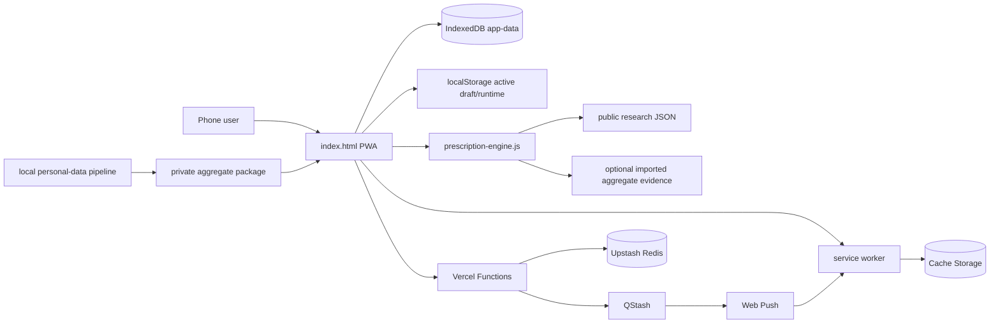
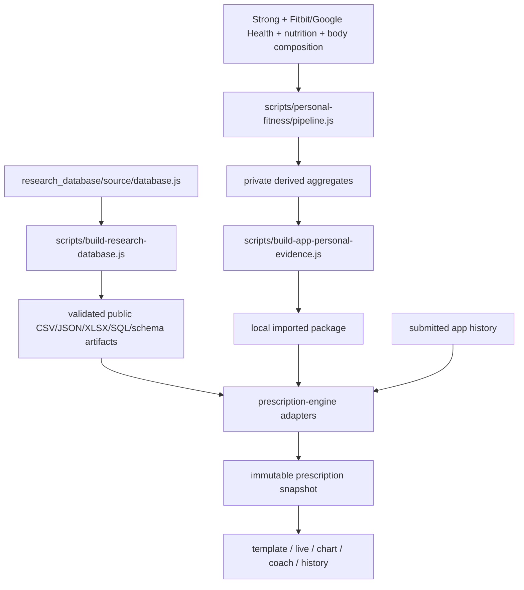

# Architecture

## Metadata

- **Purpose:** Verified technical architecture, data flows, and operational boundaries
- **Last verified:** 2026-07-18
- **Repository:** `main` @ `324f008`
- **Verification status:** VERIFIED locally; external deployment/device status is not repository-verifiable
- **Related:** [Project](PROJECT.md), [decision engine](DECISION_ENGINE.md), [UI/UX](UI_UX.md), [roadmap](ROADMAP.md), [push backend](push-backend.md)

## Living-document rule

Read this document before changing application structure, dependencies, persistence, models, schemas, APIs, authentication, integrations, data flow, builds, deployment, or testing architecture. After implementation and verification, update the affected sections and `ROADMAP.md` in the same task. New source-of-truth files and migrations must be referenced here.

Repository instructions may express an approval preference, but they cannot alter the Codex sandbox or approval policy. Those controls belong to the execution environment; see `AGENTS.md`.

## Stack and repository layout

### Guided mesocycle layer — IMPLEMENTED

`guided-mesocycle.js` is the versioned, pure planning layer (`guided-mesocycle/1.1.0`; rules `planning-rules/1.1.0`). Its persistence contract is `schemas/guided-mesocycle.v1.schema.json`. It owns draft construction, day assignments, working-set edits, moves, direct/fractional volume ledgers, combined muscle status, viability findings, and readiness-to-generate state. `index.html` supplies persistence and UI integration; `prescription-engine.js` remains authoritative for taxonomy, equipment eligibility, candidate ranking, and research-backed prescriptions.

Guided drafts persist in `data.mesocycles` with `builderMode: "guided"`, `guidedDays`, `planningProgress`, accepted exceptions, a versioned viability result, revision, linked template IDs, and an auditable `creationResult`. `planningProgress` stores the highest unlocked step, completed steps, and setup/build/viability/create revisions. Build edits retain compatible assignments while staling viability and relocking Create. Candidate selection uses transient `guidedPendingAssignment` state until Add to Day commits it. Generated templates use deterministic day-based IDs and store mesocycle, revision, training-day, and assignment identities, so retry updates instead of duplicating. A successful request persists created/updated counts and enters a durable completion view; only a named blocking finding returns the user to its affected day. Legacy automatically generated mesocycles remain readable; new creation uses the guided path. The guided draft is the structural source of truth and linked templates are derived outputs.

This is a dependency-light static PWA with Capacitor wrappers, not a bundled component-framework application.

| Area | Implementation |
| --- | --- |
| Web UI/state | HTML/CSS shell in `index.html`; ordered classic-script runtime segments from `app-foundation.js` through `app.js`; synchronized public copies in `www/` |
| Decision engine | UMD module `prescription-engine.js`; synchronized to `www/` |
| Rest lifecycle | UMD module `rest-completion-controller.js`; synchronized to `www/` |
| Persistence | IndexedDB primary, localStorage migration/fallback and compact active draft |
| Offline/install | `manifest.webmanifest`, `sw.js`, `resources/` |
| Serverless API | CommonJS Vercel Functions under `api/` |
| External services | Upstash Redis, QStash, standards-based Web Push/VAPID |
| Native shells | Capacitor 7 projects under `ios/` and `android/` |
| Research data | Source, schemas, exports, workbook, and validation under `research_database/` |
| Private analysis | Pipeline/config/schemas under `scripts/personal-fitness/` and `personal_fitness_data/` |
| Contracts | JSON Schema files under root `schemas/` |
| Verification | Dependency-free Node tests in `scripts/test-*.js`; Node-based public/private/release gates; Playwright/axe UI audit; GitHub Actions |

`npm run sync:web` is the canonical copy step from root web assets into `www/`. Root files are the editable source; duplicated `www/` files are packaging outputs.

Any cross-file runtime contract change (for example, `index.html` consuming a new `guided-mesocycle.js` field) must advance `CACHE_NAME` in `sw.js`. This retires the previous app shell and module assets together; otherwise an installed PWA can pair a new UI with an older cached engine.

The service-worker cache version is also the installed-PWA update signal. Every published runtime change must advance it so `registration.updatefound` can surface the in-app update action; changing only a cached shell asset is insufficient. An active worker serves its allowlisted document and runtime assets cache-first without background replacement. The installing worker fills a separate versioned cache, preventing a controlled page from combining JavaScript modules from different releases.

## High-level system

## Frontend and state

`index.html` contains the document shell, semantic color roles, and the Quiet Coach workspace component layer. The local-first runtime is segmented by responsibility: foundation/state/persistence/prescription (`app-foundation.js`), primary and guided-planner views (`app-views.js`), templates/history/analytics/settings presentation (`app-analysis.js`), workout mutations (`app-workout.js`), PWA/push/sync/timer integration (`app-sync.js`), grading/submission (`app-history.js`), import/export/readiness aggregation (`app-import.js`), and delegated events/startup (`app.js`). These ordered classic scripts intentionally share the browser global lexical environment; their order is a tested dependency contract. Four primary destination IDs map to Today, Plan, Progress, and More. Progress owns Overview, Lifts, and History as a bounded secondary view state. Legacy five-tab hashes normalize into those destinations. Views are generated as HTML strings and events are handled at the root through `data-action` delegation. Recommendation snapshots cross a read-only `recommendationSnapshotForDisplay` compatibility boundary before Today or Progress dereferences optional presentation fields; hard constraint rejections remain typed non-executable objects and render as bounded cards rather than full snapshots. Legacy prescription explanations cross the same presentation boundary through `recommendationExplanationForDisplay`, which extracts known text fields from structured saved values before any string operation. The projection never replaces stored snapshot or prescription data. Today role-detail presentation retains `formatPreviousSetPerformance` as the shared resistance-aware formatter for its prior submitted set. A destination-level render boundary then invalidates only derived entity/analysis caches and retries any remaining unexpected Today or Progress exception once; a second failure becomes a retryable error surface with bounded diagnostic metadata. It does not mutate workout data. Before entering the active Today renderer, a missing-session guard returns the ordinary Today home screen so stale route/runtime pointers cannot dereference an absent session.

Because each render replaces the view DOM, focus continuity is represented as an allowlisted data descriptor (`data-action` plus bounded identity fields and ordinal), never as a detached element or caller-provided selector. Initial load does not claim focus; explicit primary navigation targets the focusable `#main-content`. Modal sheets capture their invoking descriptor and verify that the resolved target is visible, enabled, programmatically focusable, and actually focused. A failed resolution or focus attempt falls back to the first visible enabled dialog control; that same filtered set owns forward/reverse Tab trapping. Closing restores the newly rendered durable trigger. The Dashboard uses a separate detail stack containing the previous detail, origin descriptor, and scroll position so nested Back navigation restores both context and focus.

The narrow large-text layout is activated only when the viewport is at most 380 CSS px and the computed root font is at least 24 px. That exact condition renders editable titles as multiline controls and permits one-column reflow and scaled controls while preserving the protected normal-scale 320 px Lift composition. At ordinary narrow text sizes, an input is upgraded only when its rendered value actually overflows. The quick-template list remains an explicit horizontal carousel; other primary-view content must not create document or nested horizontal overflow.

Active Today execution is deliberately one render column. `renderWorkout` owns the compact hero, exercise document, add/details disclosures, and submission controls; it no longer constructs a parallel session-board/support aside or a repeated bottom recovery-adjustment plan. `renderExercise` keeps deload and resistance controls in one row and uses native `details` for the resistance selector and supporting options. `renderSet` projects the comparable submitted load × reps @ RPE and date into one Previous column beside current fields. A zero-height-when-closed native set-tools disclosure owns Rest, Skip, Remove, and the nested progression rationale while retaining 44 px activation targets. These are presentation projections only: readiness, prescription snapshots, workout mutation guards, persistence, and submission semantics are unchanged. Non-Night-Stadium light packages resolve the application canvas to white; semantic card and state colors remain package-specific. Progress History derives the same stored grade tone as Recent History but renders only the grade letter beside a blue session title.

The normalized app object (`emptyData`, `normalizeLoadedData`) contains sessions, exercises, sets, templates, mesocycles, recommendation history, manual overrides, an optional personal evidence package, raw-import metadata, migration audit, revision, and settings. Settings include independent `theme` and `colorPackage` values; missing legacy package values normalize to Signal Garden, and backup import accepts only the ten declared package IDs. `applyTheme` projects both values to document data attributes and a package-specific browser theme color. IDs are UUIDs when supported. The domain migration and set classifier preserve semantics across legacy data.

Exercise identity has two explicit roles. `performanceExerciseId` is the exact identity used to retrieve prior loads and preserve named/equipment variations; `researchExerciseId` is an optional reconciled public identity used for taxonomy and science defaults. `resolveExerciseIdentityProfile` produces both plus `identitySource` and `identityVersion` (`exercise-identity/2.0.0`). A collision-free personal ID is executable even when it predates `custom_`/`user_` prefixes. A reconciled personal crosswalk such as Double Pulley Lat Pulldown keeps its personal performance identity while projecting to the public lat-pulldown research identity. Direct public catalog identity wins over a same-name personal spoof. New/imported exercises persist these fields when present; legacy records resolve them at read time without rewriting submitted history.

IndexedDB database `comprehensive-fitness`, store `state`, key `app-data` is primary. `comprehensive-fitness-data-v1` supports legacy/fallback state; runtime and a compact active draft use separate localStorage keys. Draft writes are debounced and the compact synchronous fallback protects immediate-close recovery. Completed-history calculations use revisioned caches (`scripts/test-performance.js`).

JSON replacement imports are an explicit trust boundary. Backup and private-evidence files are limited to 8 MiB using both the browser file size and the actual UTF-8 byte count; iterative shape validation caps depth/object width and rejects prototype or event-handler keys. Backup records pass versioned top-level/entity allowlists, bounded identifiers/text/collections, duplicate checks, and relationship checks before a canonical replacement is produced. Imported `dataRevision` is optional but, when present, must be a non-negative safe integer; it is never trusted as local ordering authority. An accepted replacement receives exactly the next local monotonic revision. Template sets, reps, RPE, increment, and rest values use the same finite min/max/step domain as the editor. Imported migration-audit records and nested changes additionally enforce field allowlists, typed/bounded counters, timestamps, IDs, text, and confidence values; every migration value rendered in Settings is HTML-escaped.

Before a full-backup write, every recommendation snapshot that can execute from an active exercise, active workout prescription, or template passes the engine's exported schema/checksum serializer, canonical identity and exact direct-target resolution, and (for exercise/template records) host-exercise identity binding against a prepared candidate engine. Validation does not invoke fresh prescription logic. A stale checksum, unknown schema, identity collision/unresolved identity, unrelated target, or host mismatch rejects the replacement atomically. Submitted historical snapshots are deliberately not reserialized or rewritten; their stored bytes remain historical evidence. Persisted snapshots created by an older runtime may therefore omit fields that a newer renderer recognizes. The display compatibility boundary projects safe strings, arrays, and optional metric ranges in memory only, and both unit and browser tests assert byte-equivalent source state after presentation. A private-evidence replacement likewise reconciles identities from exercise scores, prescriptions, and exercise-muscle scores against the loaded research data and constructs a complete candidate engine before the single IndexedDB write. Any invalid new identity rejects the whole replacement. Only after the candidate write succeeds does the app remove the local fallback, install runtime state, and invalidate the evidence-dependent completed-analysis, recommendation, prescription-snapshot, muscle-assignment, and entity-index caches. Rejection preserves both stores, the previous engine, runtime data, revisions, and caches.

When startup has preserved two valid but unorderable app-data copies, replacement import is blocked: otherwise an accepted import could be shadowed by the alternate on the next load. Export truthfully serializes only the selected runtime copy and identifies the preserved alternate as excluded; confirmed Clear All remains the destructive resolution before importing a replacement. Confirmed clearing inspects only an existing service-worker registration instead of awaiting the potentially never-settling `serviceWorker.ready` promise, cancels queued local saves, removes the IndexedDB database and fallback, durably writes fresh defaults, removes the alternate again, and announces completion only after that write succeeds. Persisted legacy packages are not silently rewritten: an invalid identity stays available to the reconciler for audit while canonical, prescription, muscle, history, and volume consumers fail closed. Import status is attempt-scoped and exposed through an accessible live region. Although IndexedDB is primary, the localStorage fallback may temporarily contain the complete app-data object, including workout history, settings, and an imported personal-evidence package; it is same-device recovery storage, not a privacy-free cache.

The Templates navigation path uses progressive rendering. Its first frame renders template summaries, the mesocycle controls/current-plan summary, and compact historical summaries only. Exercise editors and the full current mesocycle candidate/session review are generated after an explicit disclosure action. Template-list rendering does not run completed-history fatigue analysis or construct per-template readiness prescriptions; those decisions remain on Dashboard and in the workout-start flow. Historical records are never passed through the full editable planner renderer. Numeric template input keeps an invalid raw draft connected to its control without committing, saving, or rerendering; one accessible card-level alert identifies the error. A valid input advances one logical revision, and duplicate `input`/`change`/`focusout` delivery becomes a no-op. Deleting its exercise/template, importing, or clearing data removes the associated transient draft. This boundary is covered by `scripts/test-performance.js` and the template lifecycle suite and prevents hidden controls and candidate trees from dominating tab latency.

## Workout lifecycle

```mermaid
stateDiagram-v2
  [*] --> Idle
  Idle --> StartReview: choose template
  StartReview --> Active: explicit start
  Active --> Active: edit/complete/skip sets; timers
  Active --> CancelReview: request cancel
  CancelReview --> Idle: confirm cancel
  Active --> SubmitReview: request submit
  SubmitReview --> Active: cancel confirmation
  SubmitReview --> Submitted: confirm submit
  Submitted --> Summary: grade + lifts + PRs
  Summary --> History
  History --> EditDraft: explicit edit
  EditDraft --> Submitted: save edits and recalculate
```

Only `submitted`/completed sessions participate in canonical history and analytics (`activeCompletedWorkoutHistory`, `activeHistorySessions`). Starting a workout saves a workout prescription; exercises retain recommendation snapshots. Submission uses a per-session in-progress lock before calculations, so a routed duplicate or a reentrant call cannot duplicate analysis, persistence, sound, feedback, or sync effects. It calculates PRs and workout analysis, timestamps completion, invalidates analysis caches, persists, and queues one sync mutation. Historical snapshots are not silently recomputed after engine changes.

`getMostRecentWorkoutPerformance` is the shared live-workout history boundary. Unlike trend/fatigue analysis, it searches the full submitted archive rather than the six-month active-analysis window, because an old completed exposure is still the user's last recorded performance. A revision/date-keyed index first matches the stable performance identity and resistance type; if identity provenance changed across import/evidence versions, submitted Strong records may additionally match the exact normalized exercise name. This fallback never joins differently named variations. Current-session and deload-ineligible work remain excluded, and returned working sets retain their source session/date. Set-role matching prefers the same role and role index, then uses the same ordered working-set position so Strong classification differences do not erase real prior performance.

Workout construction treats the saved template as the minimum usable structure. A unified research/personal snapshot is accepted only when it has at least one working set and a valid rep range. Otherwise `resolvedSetTypesForPrescription` retains the template's set roles/count or creates the saved number of straight working sets. An exercise with exact submitted Strong history, matching resistance, and valid saved structure may use a non-research `history_fallback` for the three audited non-safety gaps: `unknown_exercise_identity`, `invalid_muscle_identity`, or `no_dynamic_direct_target`. It remains loggable and exposes dated prior sets without fabricating a research identity or recommendation snapshot. Collisions, corrupt snapshots, engine failures, illness, and pain restrictions remain typed and non-executable. Strong import tags generated templates with `source: "strong"` and audits dated history, usable structure, and actual workout-start eligibility after the import commit invalidates the completed-history caches.

The active workout remains one continuous scroll document. Set/rest state transitions update the persisted active-set identity and visual highlight without programmatic viewport movement; only an explicit set deep link may scroll to its requested target. Rest presentation is scoped to the timer panel and its circular icon: the resting set keeps neutral outer borders so the rest state cannot visually wrap the whole exercise card.

## Models and relationships

- A **session** has many exercises and sets, recovery input, lifecycle timestamps/state, optional template/mesocycle context, PRs, and stored analysis.
- An **exercise** belongs to a session and references its sets; it holds muscle/resistance metadata, prescription/snapshot, notes, and deload/override state.
- A **set** belongs to an exercise and has sequence/type, targets, actual load/reps/RPE, completion/skip/edit flags, resistance semantics, and inclusion flags for score/volume/progression.
- A **template** owns exercise targets and set-role definitions but does not become history until a started workout is submitted.
- A **mesocycle** holds type, dates/lifecycle, constraints, per-muscle candidate pools, program slots, a selected full-program portfolio, distributed sessions, muscle plans, and an interaction review. `activeExercises` remains a compatibility projection of the selected portfolio for older persisted plans.
- A **recommendation snapshot** records engine/schema/evidence versions, base/final prescription, readiness adjustment, evidence, checksum, and append-only overrides (`schemas/recommendation-snapshot.v1.schema.json`).

The root JSON Schemas are application decision contracts. `personal_fitness_data/schemas/` describe private pipeline artifacts; `research_database/schema/` describes public research tables. These are distinct layers.

## Decision and evidence data flow

The retained legacy automatic engine is portfolio-first and priority-ordered; it remains available for historical-plan compatibility and engine tests, not for creating new guided plans. New guided construction is user-directed. It uses the same taxonomy-defined direct sets, 0.5/0.25 fractional contribution, zero-credit incidental/unknown relationships, separate isometric fatigue, frequency, and capacity rules as live feedback and viability validation.

`research_database/source/exercise-muscle-taxonomy.js` is the single exercise–muscle relationship authority. Taxonomy 2.1.0 covers 62 canonical exercises with 151 exercise-muscle relationships and retains all 23 canonical anatomical muscle IDs. A complete projection maps them into 20 programming families; only the sternal/clavicular chest, gastrocnemius/soleus calf, and flexor/extensor neck pairs coalesce. The browser engine, planner, weekly/historical analytics, and private personal-evidence config adapter consume the mappings. Legacy name rules and personal mappings are fallback-only for custom exercises without a canonical research crosswalk.

Future prescription generation now separates exercise identity, exact target selection, and broad reporting projection. The frontend resolves catalog IDs/names/aliases through `resolveExerciseIdentity`, then asks `resolveDefaultPrescriptionTarget` for the one eligible positive-credit dynamic/mixed direct relationship and passes that exact canonical `mg_*` ID into `prescribeExercise`. Any resolver failure other than the ordinary unknown/custom branch remains typed, non-executable, and zero-dose; collision reasons introduced by later engine versions therefore fail closed without a frontend allowlist update. A custom/user identity enters research prescription generation only when the prepared personal reconciliation map explicitly trusts it. An exact Strong performance identity may still be logged through the separately marked history fallback when it has submitted history and valid saved structure; that path never calls the research engine or asserts taxonomy. Explicit valid fractional targets remain caller-controlled. Broad Back/Chest/Shoulders-style projection continues only for filters, charts, and reporting and cannot fabricate a prescription target. A stored snapshot attached to submitted history is returned as the exact object before current validation, preserving historical bytes and lineage. A snapshot reused by an active exercise or template is executable state: it must pass current schema/checksum, canonical identity, exact target, and host binding without a fresh prescription call, or it becomes the deterministic zero-dose `invalid_stored_recommendation_snapshot` hard rejection and never enters the recommendation cache.

Programming families are derived accounting, not a destructive taxonomy migration. `programming-family-ledger.js` is the shared browser/Node authority (`programming-family/1.0.0`; historical ledger `historical-family-volume/1.0.0`) consumed by the guided builder and prescription engine. It selects the strongest qualifying relationship once per exercise/family, keeps local and isometric fatigue additive and separate from hypertrophy credit, retains full precision through aggregation, and rounds only final exposed totals. Canonical muscle ownership overrides a conflicting supplied family. Historical family totals are emitted only when every used relationship has one common taxonomy version; missing or mixed provenance returns `blocked_unverifiable_taxonomy` and no family dose. Source records remain immutable, no persistent migration is required, and rollback is executable by recalculating those records with the prior relationship set. Legacy canonical `muscleTotals` remain available for compatible readers while family-aware consumers use the versioned projection.

Persistent source and mapping IDs are fail-closed. The 2.0.0 digest fixture protects 1,756 prior mappings; `rex_00754`–`rex_00765` are the `chg_0004` Cable Woodchop append, and `rex_00766`–`rex_00827` are the `chg_0005` `rule_0019` append across all 62 registered exercises. Explicit ordered registries reject undeclared, deleted, reordered, or duplicate rule/exercise source IDs—including additions that would generate zero mapping rows—and every append epoch requires a higher suffix range and matching change-log attribution.

Canonical taxonomy also controls hypertrophy-candidate eligibility. A personal-derived mapping may rank an eligible direct or positive-credit fractional relationship, but cannot promote an isometric-only, incidental, unknown, or zero-credit canonical relationship into the target muscle's candidate pool. The engine exposes `targetMuscleEffectiveness`, relationship type, set contribution, confidence, and separate overall recommendation strength. The guided UI displays…404 tokens truncated…s, muscle volume/response, sweet spots, recovery rules, scores, and prescriptions. Direct live Fitbit and nutrition APIs are not implemented. Nutrition strategies are loaded into the engine, but in-app nutrition capture is limited to adequacy/protein status.

## Readiness, progress, units, and analytics

Readiness uses a user-configured baseline plus session inputs. The app and engine both implement conservative multi-domain logic; detailed rules are catalogued in `docs/DECISION_ENGINE.md`.

Analytics include submitted-history charts, estimated-performance comparisons appropriate to resistance type, PRs, weekly volume, fatigue flags, hypertrophy scores, and workout grades. Taxonomy direct muscle sets count 1, meaningful fractional work counts 0.5 or 0.25, and fatigue-only relationships remain separate; warm-ups and excluded/deload work are filtered according to domain semantics. Chart search ranks cached catalog/history labels lexically and promotes the last explicit selection without invoking completed-history analysis for each keystroke. Rendered chart points expose only a render-epoch-scoped opaque activation key; their exact exercise, window, through-date, resistance, qualifying weeks, and point payload are recovered from the in-memory activation map, preventing an unscoped detail recomputation.

The header/settings controls use one `convertAppWeightUnit` boundary. It converts load-bearing app fields, updates explicit per-record `weightUnit`, preserves raw imports/private evidence in source units, and refreshes checksums on converted recommendation snapshots. Prescription adaptation converts a declared `prescribedLoad.unit` into the active app unit. Pounds are normalized to 0.5-lb boundaries at prescription/input/display persistence boundaries; kilograms retain three decimal places unless an equipment increment supplies a stricter boundary. Repeated switches therefore settle on a stable supported value instead of accumulating four-decimal artifacts. Round-trip and source-boundary behavior is tested in `scripts/test-resistance-model.js`; snapshot integrity is tested in `scripts/test-prescription-engine.js`.

## Authentication, backend, and external integration

There is no account authentication. Push registration and rate-limited `api/sync/authorize.js` can create an installation-scoped secret; later requests use a bearer token whose hash is compared in constant time (`api/_lib/security.js`). Push and workout-cloud-copy consent are independent. Workout writes require server-side `syncConsent=1`, recheck installation state and consent atomically with the Redis commit, reject payloads over 256 KiB, and expire after 90 days. Deleted or deleting installation tombstones cannot be reactivated. Timer IDs are installation-scoped hashes and every schedule carries a `timerVersion`; cancellation, delivery, and active-pointer checks reject stale versions.

Every JSON response sent through the shared `apiHandler` receives a new server-generated opaque `X-Request-ID` and produces exactly one structured terminal console event. The event schema is deliberately limited to an ISO timestamp, fixed event name, request ID, normalized method, allowlisted static route, status class, and bounded duration. Client request IDs are never trusted, and headers, authorization tokens, bodies, query strings, network addresses, installation/device/workout identifiers, error messages, and stacks are excluded. Unknown routes and methods fail closed to non-identifying labels. Unexpected errors remain opaque `500` responses; this local structured event contract does not add an external logging service or change data retention.

Rest completion can be entirely foreground/local. Optional background delivery writes authoritative Redis state before QStash publication. Delivery obtains a short-lived claim token, rechecks the installation, timer version, and active pointer immediately before Web Push, and may commit success/retry state only while it still owns that claim. Cancellation and installation deletion revoke claims before scheduler cleanup. The server accepts only HTTPS push endpoints on the default FCM, Mozilla, and Apple origins or an explicitly configured `WEB_PUSH_ALLOWED_ORIGINS` allowlist. Web platform constraints mean custom sound/haptic/lock-screen timing cannot be guaranteed.

Installation deletion is immediately revoking and bounded: indexed per-install registries are scanned in pages, cleanup is limited per request, and an HTTP 202 response instructs the caller to continue until the retained tombstone reaches `deleted`. Installation/tombstone hashes use a rolling 180-day TTL; timers use 7 days; workout payloads and mutation receipts use 90 days. The global `cf:installations` registry has no member TTL; the installation's membership is removed on completed deletion. An already-in-flight Web Push network request cannot be recalled, but its revoked claim cannot commit success, retry, or resurrect state. Workout sync is installation-authorized, payload- and relationship-bounded, idempotent by mutation ID, conflict-aware by revision and content, and write-only; it exposes no read/restore endpoint.

Workout-mutation upload has a separate persisted user consent that defaults off. During enablement, the checkbox is restored to the canonical value and marked pending; enabled state is rendered only after installation authorization, `/api/sync/consent`, and the explicit IndexedDB app-data write succeed. Every transition advances an in-memory epoch before asynchronous work continues. Queue reads, writes, delayed flushes, and uploads recheck the exact consent/epoch before and after asynchronous boundaries; revocation cancels the pending flush, aborts in-flight fetches, waits out stale operations, clears the queue durably, and deletes retained server workout/mutation keys. Offline revocation remains pending for retry. Notification permission does not imply workout-upload consent.

The Settings Danger Zone exposes explicit remote installation deletion. The client retains the installation identifier and bearer authorization while it follows HTTP 202 cleanup, honors `Retry-After`, prevents overlapping continuations, resumes after reload/online recovery, and clears the token and local sync queue only after terminal `deleted`. Push-identity restore always evaluates both IndexedDB and the localStorage failed-write journal: a pending-deletion bearer outranks an unrelated ordinary/generated identity, while a strictly newer terminal deletion for the same installation prevents stale-bearer resurrection. The selected state is reconciled to IndexedDB before the journal is removed. Confirmed local clearing first revokes workout consent, deletes the remote installation, and cancels any active timer; it fails closed while offline or any cleanup remains unresolved so the required bearer is not orphaned.

Rest cancellation sends the exact `timerVersion` and tracks an in-flight schedule by the client timer ID/version. A cancel request marks that composite immediately; if scheduling later returns a distinct authoritative notification ID, the client cancels it before treating the schedule as complete. A lost or ambiguous schedule response creates a durable cancellation for the client ID/version. Service-worker cache version 38 checks both payload `notificationId` and `timerId` at the exact version (defaulting legacy payloads to version 1), so canceling an older timer cannot suppress its replacement. Its cache policy is a public allowlist with network-only/no-store handling for API, private-data, backup, and export paths.

**PARTIALLY IMPLEMENTED / NEEDS REVIEW:** explicit remote deletion, fail-closed local clearing, consent revocation, and schedule/cancel reconciliation are integrated. Automatic notification-disable orchestration and the irreducible already-dispatched Web Push boundary remain qualified. There is still no account-backed restore lifecycle.

Required server environment names are documented without values in `.env.example`. Secrets must remain in deployment configuration.

## Error handling and privacy boundaries

The document shell and executable application runtime have separate ownership: `index.html` contains markup/styles and ordered owned script references, while eight bounded application segments own the local-first runtime behavior. Domain modules remain separate (`programming-family-ledger.js`, `prescription-engine.js`, `guided-mesocycle.js`, `rest-completion-controller.js`, and `backup-contract.js`) and load before the application segments. No segment exceeds the tested 300 KiB concentration ceiling; `scripts/test-runtime-boundary.js` parses each segment, verifies its exact load order, and parses their concatenated contract. Static contract tests read the same explicit combined view without restoring runtime JavaScript to HTML. Root/`www` parity, service-worker v43, and the deployment CSP verify every segment as a first-class public asset.

Startup always inspects both IndexedDB and the localStorage fallback. IndexedDB reads retain each record's persistence `updatedAt` metadata without changing value-only callers. New local fallbacks use the versioned `comprehensive-fitness-local-fallback` envelope with source, timestamp, conflict marker, and app data; legacy plain app-data remains readable. Each candidate must be a compatible object with a finite non-negative integer `dataRevision`. Corrupt candidates are quarantined. A higher revision wins; equal-revision candidates are deep-canonicalized only when both are valid, identical content deduplicates, and otherwise a strictly newer reliable persistence timestamp wins. If divergent equal-revision copies have missing or equal timestamps, ordering is unknowable: IndexedDB remains the runtime copy, the local alternate is wrapped and marked conflict-preserved, a visible recovery status asks for export, and neither startup promotion nor later ordinary/stable saves may delete or replace that alternate. The marker survives later revision changes and reloads; only explicitly confirmed **Clear All Local App Data** removes both stores and releases it. The conflict-clear browser regression seeds divergent IndexedDB/fallback templates, confirms deletion, checks the accessible completion announcement and fresh zero-template state, and reloads to prove neither alternate nor conflict returns. Outside conflict recovery, a selected local fallback remains until its normalized data is successfully promoted to IndexedDB, after which cleanup is safe.

A submitted-history edit is an in-memory transaction: entering edit mode cancels queued/idle full-data saves, clones the complete pre-edit state, and durably writes that stable snapshot before opening the transaction. This preserves an unrelated debounced template or settings change while ensuring temporary history mutations never reach storage. Edit startup captures the data revision, active tab, active session, and viewed-history identity. If any changes while persistence is awaited, the older transaction is abandoned without rollback and the start lock remains active while a fresh clone of the current state is awaited through the same dual-store persistence helper. Success explicitly says the current changes were saved and asks the user to retry; dual-store failure keeps those changes in memory, keeps editing closed, and warns that they are not durable and should be exported or retried before reload. Ordinary full-data persistence refuses to write while the transaction exists, and pagehide/beforeunload retain only non-edit runtime state. Explicit Save ends the transaction before persisting; explicit discard restores its cloned original. Tab navigation and popstate use the same cancel-edit confirmation, and a blocked Back navigation pushes the canonical `#lift` state without recursively dispatching navigation. An externally activated service-worker controller defers its reload while history editing is starting or active. After Save or Discard, the update banner requires an explicit `Update now`; that action persists a fresh cloned stable snapshot and refuses to reload when both IndexedDB and localStorage fail. An ordinary active workout still defers activation, but a destination render failure exposes the same persistence-gated update action so a broken view cannot trap the installed app on an incoherent release. Public research data is fetched once. Optional private-evidence URL discovery occurs only on exact loopback hosts or a Capacitor native runtime, resolves every candidate URL against the current document, requires the exact same origin, and uses `credentials: "same-origin"` with `cache: "no-store"`; a hosted PWA never probes private paths. Protected/unavailable local sources therefore fall back to research-led behavior. APIs return structured JSON errors and fail authorization. Service-worker navigation falls back to cached `index.html`.

Private raw/normalized/derived/reports data must not enter public web or native assets. `sync:web` copies an explicit public allowlist and prunes stale sensitive directories from `www/` and Capacitor public roots; `verify:pwa` checks parity, native privacy controls, and all payload roots. Personal evidence reaches an installation only through user-selected aggregate import and stays in local IndexedDB. `.vercelignore` remains defense in depth. Exported app backups and Redis workout payloads may contain personal workout data and should be treated as sensitive.

Numeric history edits update the in-memory set and logical revision without rerendering, so blur cannot detach and swallow the first Save Edits click; repeated identical browser events are no-ops. Explicit Save ends the transaction before one durable write. Separately, an ordinary save that exhausts both stores rerenders its recovery message immediately instead of waiting for another interaction.

## Testing, build, and deployment

User-facing changes require deployment verification in addition to local validation. The completion gate is: governing documentation review; implementation; tests/lint/build; confirmation that the intended branch and latest deployment are live; browser inspection of the hosted URL through the affected flow at mobile and desktop widths; refresh/repeat to detect stale assets; console/runtime and visual checks; and a work-log entry using `docs/WORK_LOG_TEMPLATE.md`. If the hosted site differs, investigate branch/project, build, cache/service-worker, alias, environment, or runtime causes. Do not mark the work complete from local code or a written summary alone.

- Runtime pins are Node `22.23.1` and npm `10.9.8` (`.node-version`, `.nvmrc`, `package.json`). GitHub Actions use the same Node patch release and immutable 40-character action SHAs with read-only permissions and disabled checkout credential persistence.
- `npm test` / `npm run test:public`: discover filesystem entries matching `scripts/test-*.js`, sort them, and exclude the explicitly private `test-personal-fitness-data.js` harness. `npm run test:private` is an explicit local-only gate that requires ignored personal artifacts; `npm run test:all-local` combines both.
- `npm run research:build` / `research:validate`: regenerate and validate research outputs.
- `npm run personal:build` / `personal:validate`: local private analysis only.
- `npm run check:public`: lint, workflow validation, privacy scanning, full and production dependency audit policies, public tests, research validation, and PWA verification.
- `npm run release:verify`: clean-source verification, the complete public gate, and the Playwright UI audit. `npm run verify:pwa` is the cross-platform Node verifier; `npm run sync:web` remains the canonical packaging synchronization command.
- The executable app runtime is external, so Vercel `script-src` is exactly `'self'` and has no line-ending-sensitive inline hash. The deployment contract rejects executable inline script bodies, obsolete hashes, missing/reordered runtime segments, or root/packaged parity drift.
- `npm run check:workflows` parses workflow YAML and enforces immutable action SHAs, least-privilege permissions, disabled persisted checkout credentials, the exact Node patch, and prohibition of `pull_request_target`. `npm run check:privacy` scans tracked/archive paths and content for personal-data and secret patterns. `npm run check:clean-source` prevents release from an uncommitted tracked-source state.
- `npm run audit:dependencies:full` fails on high/critical findings while reporting accepted moderate development-only findings; `npm run audit:dependencies:production` fails on any production severity. `npm run test:release-automation` regression-tests these gates. CI installs with `npm ci --ignore-scripts` before running them.
- Daily Codex browser QA follows `docs/DAILY_BROWSER_QA.md`: it traverses primary navigation and the critical workout lifecycle at desktop/mobile widths, checks console and visual state, and requires a regression test plus browser re-verification for each fix.
- Repository-owned Playwright UI QA runs through `npm run audit:ui`. It covers all four primary destinations at mobile/desktop Chromium viewports, axe WCAG A/AA rules, overflow/clipping, console errors, source-style ceilings, documentation presence, and approved screenshots. Set `PLAYWRIGHT_BASE_URL` to run the same suite against the public hosted origin; this disables the local test server. Deployment-specific Vercel URLs may require an authenticated browser, so unattended hosted automation should use the public production alias while the signed-in browser is used for deployment-specific inspection. GitHub Actions runs the local audit weekly and on manual dispatch; artifacts and the structured Markdown report are retained for review.
- `npm run cap:sync`: copy web assets and update native projects.
- `npm run dev`: dependency-light local server.

Deployment configuration is explicit in `vercel.json`, including strict application-wide security headers. `.github/workflows/public-ci.yml` runs public domain/schema, research/PWA, and Chromium UI jobs for pull requests and `main`; `.github/workflows/weekly-ui-audit.yml` provides the scheduled/manual audit. Private evidence validation is deliberately excluded from public CI. Native release still requires external signing/toolchains.

Repository publication follows `AGENTS.md`: verified source, tests, schemas, public research exports, and documentation are committed and pushed to GitHub `main` by default. Raw/normalized/derived/reported or packaged personal evidence, app exports, local databases, credentials, and secrets remain local and must be excluded after an explicit staged-file privacy review. Ignore rules provide defense in depth but do not replace that review.

## Decisions, risks, and debt

Mesocycle candidate detail remains progressively rendered: Templates defers the full planner review, the review renders one selected Program Slot, and unselected alternates return no markup until explicitly expanded. Standardized equipment IDs are stored in settings. Empty legacy selections normalize to explicit `all`; an explicit mesocycle restriction replaces `all` or intersects with an explicit Settings restriction and fails closed if nothing remains. The engine requires one complete equipment option for each exercise. Multi-item requirements and alternative setups are evaluated before candidate scoring, so restricted candidates never enter portfolio, alternate, comparison, or session construction. A restricted personal-only record without verified equipment metadata fails closed and receives an inspectable exclusion reason.

- **Decision:** Local-first static app minimizes infrastructure and account requirements.
- **Decision:** One prescription snapshot feeds every app surface; tests enforce this.
- **Decision:** Separate public research, private personal evidence, and operational Redis data.
- **Residual risk:** the eight application segments still share one ordered classic-script lexical environment, so moving declarations across boundaries requires parity and browser verification. The largest segment is currently 236,903 bytes and the boundary test enforces a 300 KiB ceiling. A future migration to explicit module imports can strengthen dependency enforcement after offline/native compatibility is verified.
- **Risk:** Root/`www` duplication requires disciplined synchronization.
- **Decision:** The prescription engine is the only readiness-scoring path. If unavailable, the app conservatively holds the base plan; illness/pain still forces rest/modify guidance.
- **Decision:** A confirmed pain-free substitute remains executable only while its observed name, saved prescription, and safety audit resolve to one current catalog identity that still satisfies equipment, exclusion, scope, and substitution constraints. Drift restores the deterministic block. Only recognized native constraint `Error` objects are translated into named hard-constraint results; unexpected faults remain non-executable engine failures.
- **Risk:** Redis sync is write-only and may create an expectation of recoverability not supported by UI/API.
- **PARTIALLY IMPLEMENTED:** Public CI includes Playwright, axe, responsive/overflow, console, approved-screenshot checks, and the implemented accessibility/design contract for route focus, modal focus, Dashboard restoration, target sizing, reduced motion, forced colors, and exact 320 px/200% reflow. Dedicated protected Lift/Dashboard behavior and intentionally refreshed Quiet Modular Navy baselines cover mobile, tablet, desktop, dark, and zoom-equivalent reference states. Ordinary five-view mobile/desktop goldens were refreshed in the same reviewed redesign. Physical native-device CI remains absent.
- **NEEDS REVIEW:** External production, Upstash region/status, and physical iPhone acceptance claims in operational docs require human re-verification.

## Planned React presentation boundary

**IMPLEMENTED specification / PLANNED production integration:** `redesign/src/contract.ts` establishes a typed seam between the future Dual Track shell and the existing application. UI read models cover next action, readiness, active workout, plan, progress, and system/data status. Discriminated commands cover start/resume, readiness, set/rest mutation, overrides, explicit submission/cancel, template/mesocycle mutation, history editing, settings, backup, consent, and conflicts. Effect ports isolate persistence, caching, notifications, sync, wake lock, audio, and haptics.

The current engines, schemas, IndexedDB layout, backup contract, APIs, service worker, consent rules, and immutable history snapshots remain authoritative. The Vite entry under `redesign/` is synthetic and non-production; it does not access canonical persistence. Production adoption must proceed through a separate entry and pass adapter, parity, offline, privacy, hosted-browser, PWA, and Capacitor gates before the main entry changes. See `docs/design/REDESIGN_MIGRATION_BLUEPRINT.md`.
