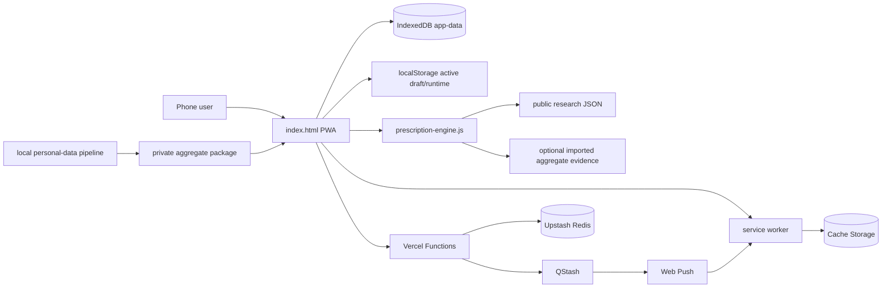
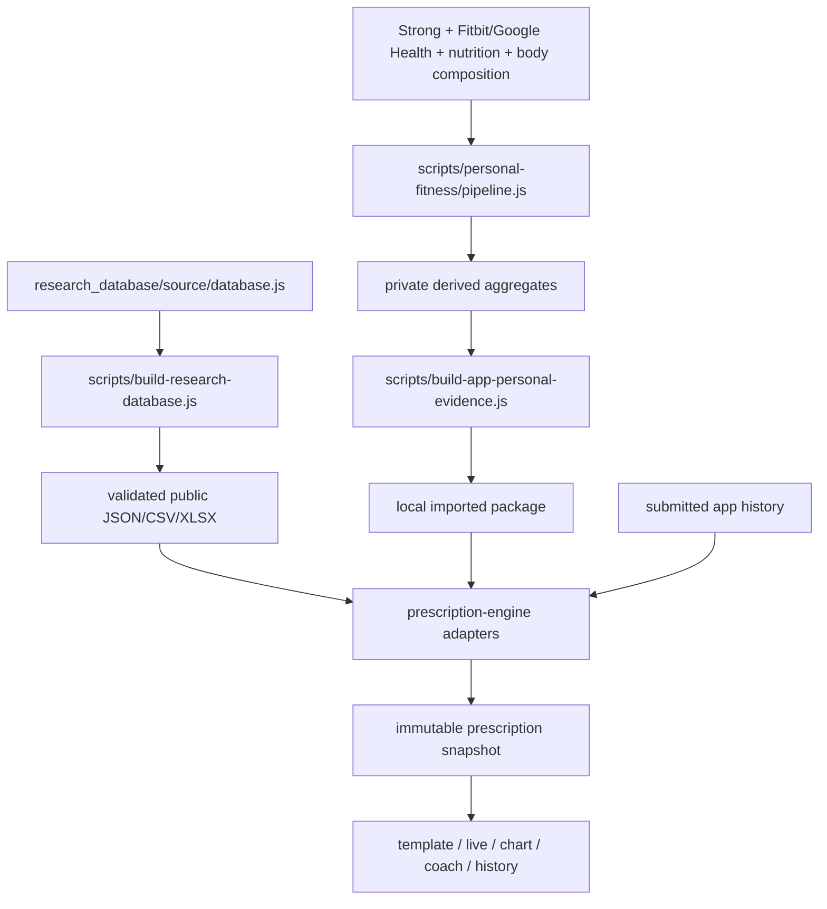

# Architecture

## Metadata

- **Purpose:** Verified technical architecture, data flows, and operational boundaries
- **Last verified:** 2026-07-11
- **Repository:** `main` @ `7c52a2b`
- **Verification status:** VERIFIED locally; external deployment/device status is not repository-verifiable
- **Related:** [Project](PROJECT.md), [decision engine](DECISION_ENGINE.md), [UI/UX](UI_UX.md), [roadmap](ROADMAP.md), [push backend](push-backend.md)

## Living-document rule

Read this document before changing application structure, dependencies, persistence, models, schemas, APIs, authentication, integrations, data flow, builds, deployment, or testing architecture. After implementation and verification, update the affected sections and `ROADMAP.md` in the same task. New source-of-truth files and migrations must be referenced here.

Repository instructions may express an approval preference, but they cannot alter the Codex sandbox or approval policy. Those controls belong to the execution environment; see `AGENTS.md`.

## Stack and repository layout

### Guided mesocycle layer — IMPLEMENTED

`guided-mesocycle.js` is the versioned, pure planning layer (`guided-mesocycle/1.1.0`; rules `planning-rules/1.1.0`). Its persistence contract is `schemas/guided-mesocycle.v1.schema.json`. It owns draft construction, day assignments, working-set edits, moves, direct/fractional volume ledgers, combined muscle status, viability findings, and readiness-to-generate state. `index.html` supplies persistence and UI integration; `prescription-engine.js` remains authoritative for taxonomy, equipment eligibility, candidate ranking, and research-backed prescriptions.

Guided drafts persist in `data.mesocycles` with `builderMode: "guided"`, `guidedDays`, `planningProgress`, accepted exceptions, a versioned viability result, revision, linked template IDs, and an auditable `creationResult`. `planningProgress` stores the highest unlocked step, completed steps, and setup/build/viability/create revisions. Build edits retain compatible assignments while staling viability and relocking Create. Candidate selection uses transient `guidedPendingAssignment` state until Add to Day commits it. Generated templates use deterministic day-based IDs and store mesocycle, revision, training-day, and assignment identities, so retry updates instead of duplicating. A successful request persists created/updated counts and enters a durable completion view; only a named blocking finding returns the user to its affected day. Legacy automatically generated mesocycles remain readable; new creation uses the guided path. The guided draft is the structural source of truth and linked templates are derived outputs.

This is a dependency-light static PWA with Capacitor wrappers, not a bundled component-framework application.

| Area | Implementation |
| --- | --- |
| Web UI/state | Inline HTML/CSS/JavaScript in `index.html`; synchronized copy in `www/index.html` |
| Decision engine | UMD module `prescription-engine.js`; synchronized to `www/` |
| Rest lifecycle | UMD module `rest-completion-controller.js`; synchronized to `www/` |
| Persistence | IndexedDB primary, localStorage migration/fallback and compact active draft |
| Offline/install | `manifest.webmanifest`, `sw.js`, `resources/` |
| Serverless API | CommonJS Vercel Functions under `api/` |
| External services | Upstash Redis, QStash, standards-based Web Push/VAPID |
| Native shells | Capacitor 7 projects under `ios/` and `android/` |
| Research data | Source, schemas, exports, workbook, and validation under `research_database/` |
| Private analysis | Pipeline/config/schemas under `scripts/personal-fitness/` and `personal_fitness_data/` |
| Contracts | JSON Schema files under root `schemas/` |
| Verification | Dependency-free Node tests in `scripts/test-*.js`; PWA PowerShell verifier |

`npm run sync:web` is the canonical copy step from root web assets into `www/`. Root files are the editable source; duplicated `www/` files are packaging outputs.

Any cross-file runtime contract change (for example, `index.html` consuming a new `guided-mesocycle.js` field) must advance `CACHE_NAME` in `sw.js`. This retires the previous app shell and module assets together; otherwise an installed PWA can pair a new UI with an older cached engine. Cache Storage accepts only the immutable same-origin public-shell allowlist without query strings; API, personal-data, backup/export, database, cross-origin, unlisted, private, and no-store responses bypass it. Navigation fetches use `cache: "no-store"` before the allowlisted offline fallback.

## High-level system

## Frontend and state

`index.html` contains rendering, event delegation, domain calculations, migration code, persistence, imports, and push/sync clients. Five primary tab IDs map to Workout, Dashboard, Templates, Charts, and Settings. Views are generated as HTML strings and events are handled at the root through `data-action` delegation.

The normalized app object (`emptyData`, `normalizeLoadedData`) contains sessions, exercises, sets, templates, mesocycles, recommendation history, manual overrides, an optional personal evidence package, raw-import metadata, migration audit, revision, and settings. IDs are UUIDs when supported. The domain migration and set classifier preserve semantics across legacy data.

App JSON export/import crosses the isolated `backup-contract.js` boundary before normalization or persistence. New exports declare `comprehensive-fitness-backup/2.0.0`; legacy app-data version 2 exports remain accepted. The boundary allowlists top-level capabilities, clones into prototype-free objects, bounds size/depth/collection counts, rejects unsupported versions and dangerous property names, validates structural IDs and uniqueness, and enforces session/exercise/set and active-mesocycle references. User-authored text remains data and must still pass through the existing escaped rendering boundary. Strong CSV and private aggregate evidence retain their separate import contracts.

IndexedDB database `comprehensive-fitness`, store `state`, key `app-data` is primary. `comprehensive-fitness-data-v1` supports legacy/fallback state; runtime and a compact active draft use separate localStorage keys. Draft writes are debounced and the compact synchronous fallback protects immediate-close recovery. Completed-history calculations use revisioned caches (`scripts/test-performance.js`).

The Templates navigation path uses progressive rendering. Its first frame renders template summaries, the mesocycle controls/current-plan summary, and compact historical summaries only. Exercise editors and the full current mesocycle candidate/session review are generated after an explicit disclosure action. Template-list rendering does not run completed-history fatigue analysis or construct per-template readiness prescriptions; those decisions remain on Dashboard and in the workout-start flow. Historical records are never passed through the full editable planner renderer. This boundary is covered by `scripts/test-performance.js` and prevents hidden controls and candidate trees from dominating tab latency.

## Workout lifecycle

```mermaid
stateDiagram-v2
  [*] --> Idle
  Idle --> StartReview: choose template
  StartReview --> Active: explicit start
  Active --> Active: edit/complete/skip sets; timers
  Active --> CancelReview: request cancel
  CancelReview --> Idle: confirm cancel
  Active --> SubmitReview: request submit
  SubmitReview --> Active: cancel confirmation
  SubmitReview --> Submitted: confirm submit
  Submitted --> Summary: grade + lifts + PRs
  Summary --> History
  History --> EditDraft: explicit edit
  EditDraft --> Submitted: save edits and recalculate
```

Only `submitted`/completed sessions participate in canonical history and analytics (`activeCompletedWorkoutHistory`, `activeHistorySessions`). Starting a workout saves a workout prescription; exercises retain recommendation snapshots. Submission calculates PRs and workout analysis, timestamps completion, invalidates analysis caches, and persists. A cloud mutation is queued only when the separate versioned workout-cloud-copy consent is enabled. Historical snapshots are not silently recomputed after engine changes.

## Models and relationships

- A **session** has many exercises and sets, recovery input, lifecycle timestamps/state, optional template/mesocycle context, PRs, and stored analysis.
- An **exercise** belongs to a session and references its sets; it holds muscle/resistance metadata, prescription/snapshot, notes, and deload/override state.
- A **set** belongs to an exercise and has sequence/type, targets, actual load/reps/RPE, completion/skip/edit flags, resistance semantics, and inclusion flags for score/volume/progression.
- A **template** owns exercise targets and set-role definitions but does not become history until a started workout is submitted.
- A **mesocycle** holds type, dates/lifecycle, constraints, per-muscle candidate pools, program slots, a selected full-program portfolio, distributed sessions, muscle plans, and an interaction review. `activeExercises` remains a compatibility projection of the selected portfolio for older persisted plans.
- A **recommendation snapshot** records engine/schema/evidence versions, base/final prescription, readiness adjustment, evidence, checksum, and append-only overrides (`schemas/recommendation-snapshot.v1.schema.json`).

The root JSON Schemas are application decision contracts. `personal_fitness_data/schemas/` describe private pipeline artifacts; `research_database/schema/` describes public research tables. These are distinct layers.

## Decision and evidence data flow

The retained legacy automatic engine is portfolio-first and priority-ordered; it remains available for historical-plan compatibility and engine tests, not for creating new guided plans. New guided construction is user-directed. It uses the same taxonomy-defined direct sets, 0.5/0.25 fractional contribution, zero-credit incidental/unknown relationships, separate isometric fatigue, frequency, and capacity rules as live feedback and viability validation.

`research_database/source/exercise-muscle-taxonomy.js` is the single exercise–muscle relationship authority. Database 2.0 generates versioned mapping and review-queue exports. The browser engine, planner, weekly/historical analytics, and private personal-evidence config adapter consume those mappings. Legacy name rules and personal mappings are fallback-only for custom exercises without a canonical research crosswalk. Historical volume is derived atomically from one loaded taxonomy version; logged workout facts remain immutable.

Canonical taxonomy also controls hypertrophy-candidate eligibility. A personal-derived mapping may rank an eligible direct or positive-credit fractional relationship, but cannot promote an isometric-only, incidental, unknown, or zero-credit canonical relationship into the target muscle's candidate pool. The engine exposes `targetMuscleEffectiveness`, relationship type, set contribution, confidence, and separate overall recommendation strength. The guided UI displays the target-specific value.

`mesocycle/2.2.0` adds explicit scope persistence: `availableMuscleGroupIds`, `includedMuscleGroupIds`, structured `omittedMuscleGroups`, and `scopeConfirmed`. Scope filtering occurs before slot and portfolio generation. Generated templates use each session exercise's allocated `plannedSets`, not a newly recomputed generic exercise target. `mesocycle/2.3.0` adds normalized candidate `equipmentRequirements` (OR paths containing AND requirements) and `jointActions`, which are persisted alongside the legacy research equipment/movement fields.

The planner stores simplified selected capabilities but evaluates detailed exercise requirements. `all` means unrestricted Standard Gym; `bodyweight`, `bands`, and `dumbbell` provide only that named capability; `barbell` expands to barbell and plates but never implies a rack; `rack` expands to rack, flat/incline bench, pull-up bar, and Nordic anchor; `cable_station` expands to cable station and its common pull-up-bar capability. A detailed exercise requirement remains an AND-list and alternate paths remain OR choices. This presentation bundle boundary avoids weakening the research taxonomy.

Internal IDs remain persistence/engine values. The frontend `presentationLabel` adapter is the centralized display boundary for muscle IDs, roles, confidence states, structures, lifecycle enums, session IDs, and validation severity. New planner UI must pass internal values through that adapter rather than mutating persisted values.

The personal pipeline normalizes source data and produces workout-recovery links, exercise-session metrics, muscle volume/response, sweet spots, recovery rules, scores, and prescriptions. Direct live Fitbit and nutrition APIs are not implemented. Nutrition strategies are loaded into the engine, but in-app nutrition capture is limited to adequacy/protein status.

## Readiness, progress, units, and analytics

Readiness uses a user-configured baseline plus session inputs. The app and engine both implement conservative multi-domain logic; detailed rules are catalogued in `docs/DECISION_ENGINE.md`.

Analytics include submitted-history charts, estimated-performance comparisons appropriate to resistance type, PRs, weekly volume, fatigue flags, hypertrophy scores, and workout grades. Taxonomy direct muscle sets count 1, meaningful fractional work counts 0.5 or 0.25, and fatigue-only relationships remain separate; warm-ups and excluded/deload work are filtered according to domain semantics.

The header/settings controls use one `convertAppWeightUnit` boundary. It converts load-bearing app fields, updates explicit per-record `weightUnit`, preserves raw imports/private evidence in source units, and refreshes checksums on converted recommendation snapshots. Prescription adaptation converts a declared `prescribedLoad.unit` into the active app unit. Pounds are normalized to 0.5-lb boundaries at prescription/input/display persistence boundaries; kilograms retain three decimal places unless an equipment increment supplies a stricter boundary. Repeated switches therefore settle on a stable supported value instead of accumulating four-decimal artifacts. Round-trip and source-boundary behavior is tested in `scripts/test-resistance-model.js`; snapshot integrity is tested in `scripts/test-prescription-engine.js`.

## Authentication, backend, and external integration

There is no account authentication. Push registration and rate-limited `api/sync/authorize.js` can create an installation-scoped secret; later requests use a bearer token whose hash is compared in constant time (`api/_lib/security.js`). Push and workout-cloud-copy consent are independent. Workout writes require both installation authorization and server-side `syncConsent=1`, reject payloads over 256 KB, are idempotent by mutation ID, and expire after 90 days. `api/sync/consent.js` disables future writes and scans/deletes indexed plus legacy workout/mutation keys. Push revocation cancels active timers and clears subscription material; full installation revocation also deletes the credential and retained workout data. No read/restore endpoint exists.

Rest completion can be entirely foreground/local. Optional background delivery schedules QStash, records ownership/status in Redis, delivers Web Push, and lets `sw.js` show or route a notification. Web platform constraints mean custom sound/haptic/lock-screen timing cannot be guaranteed.

Required server environment names are documented without values in `.env.example`. Secrets must remain in deployment configuration.

## Error handling and privacy boundaries

Persistence falls back from IndexedDB to localStorage. Personal evidence URL loading tolerates protected/unavailable private sources and continues research-led. APIs return structured JSON errors and fail authorization. Service-worker navigation falls back only for the four public navigation paths, and notification targets are restricted to non-sensitive same-origin URLs.

Private raw/normalized/derived/reports data must not enter public web or native assets. `sync:web` copies an explicit public allowlist and removes stale sensitive directories from `www/` and the Capacitor public directories before packaging; `verify:pwa` checks source parity, scans all three payload roots, and verifies native privacy controls. Personal evidence reaches an installation only through the user-controlled aggregate-package import and stays in local IndexedDB. `.vercelignore` remains deployment defense in depth. Exported app backups and Redis workout payloads may contain personal workout data and should be treated as sensitive.

Workout cloud copy defaults off for new and legacy local settings. Notification registration cannot queue or flush workout mutations. Startup/online reconciliation deletes legacy implicitly uploaded data when the local installation credential remains available. Disabling consent immediately stops and clears local pending uploads, then confirms server deletion; offline revocation is retained and retried. Local-data clearing fails closed while authorization/deletion cannot be confirmed, preventing the credential needed for deletion from being discarded first. `scripts/test-sync-consent.js` covers these client/server invariants and Redis pattern deletion.

Tampered app backups fail closed before replacing current state. Validation errors are shown in Settings, and a rejected import does not call persistence. `scripts/test-backup-contract.js` covers version mismatch, hostile structural identifiers, broken references, resource limits, prototype-pollution keys, and the application import/export wiring.

## Testing, build, and deployment

User-facing changes require deployment verification in addition to local validation. The completion gate is: governing documentation review; implementation; tests/lint/build; confirmation that the intended branch and latest deployment are live; browser inspection of the hosted URL through the affected flow at mobile and desktop widths; refresh/repeat to detect stale assets; console/runtime and visual checks; and a work-log entry using `docs/WORK_LOG_TEMPLATE.md`. If the hosted site differs, investigate branch/project, build, cache/service-worker, alias, environment, or runtime causes. Do not mark the work complete from local code or a written summary alone.

- `npm test`: domain, safety, grade, expectation, rest, prescription, contract, integration, performance, set, and private-artifact tests.
- `npm run research:build` / `research:validate`: regenerate and validate research outputs.
- `npm run personal:build` / `personal:validate`: local private analysis only.
- `npm run sync:web` then `npm run verify:pwa`: build the public-only payload, prune stale sensitive copies, and verify PWA/native parity and privacy controls.
- Daily Codex browser QA follows `docs/DAILY_BROWSER_QA.md`: it traverses primary navigation and the critical workout lifecycle at desktop/mobile widths, checks console and visual state, and requires a regression test plus browser re-verification for each fix.
- Repository-owned Playwright UI QA runs through `npm run audit:ui`. It covers all five primary destinations at mobile/desktop Chromium viewports, axe WCAG A/AA rules, overflow/clipping, console errors, source-style ceilings, documentation presence, and approved screenshots. Set `PLAYWRIGHT_BASE_URL` to run the same suite against the public hosted origin; this disables the local test server. Deployment-specific Vercel URLs may require an authenticated browser, so unattended hosted automation should use the public production alias while the signed-in browser is used for deployment-specific inspection. GitHub Actions runs the local audit weekly and on manual dispatch; artifacts and the structured Markdown report are retained for review.
- `npm run cap:sync`: copy web assets and update native projects.
- `npm run dev`: dependency-light local server.

Deployment configuration is inferred as Vercel from `api/`, `.vercelignore`, and docs; no `vercel.json` or CI workflow is present. Native release requires external signing/toolchains.

Repository publication follows `AGENTS.md`: verified source, tests, schemas, public research exports, and documentation are committed and pushed to GitHub `main` by default. Raw/normalized/derived/reported or packaged personal evidence, app exports, local databases, credentials, and secrets remain local and must be excluded after an explicit staged-file privacy review. Ignore rules provide defense in depth but do not replace that review.

## Decisions, risks, and debt

Mesocycle candidate detail remains progressively rendered: Templates defers the full planner review, the review renders one selected Program Slot, and unselected alternates return no markup until explicitly expanded. Standardized equipment IDs are stored in settings. Empty legacy selections normalize to explicit `all`; otherwise the engine requires one complete equipment option for each exercise. Multi-item requirements and alternative setups are evaluated before candidate scoring, so restricted candidates never enter portfolio, alternate, comparison, or session construction. A restricted personal-only record without verified equipment metadata fails closed and receives an inspectable exclusion reason.

- **Decision:** Local-first static app minimizes infrastructure and account requirements.
- **Decision:** One prescription snapshot feeds every app surface; tests enforce this.
- **Decision:** Separate public research, private personal evidence, and operational Redis data.
- **Risk:** `index.html` is about 790 KB and combines UI, state, domain logic, imports, and client integration; change isolation is weak.
- **Risk:** Root/`www` duplication requires disciplined synchronization.
- **Decision:** The prescription engine is the only readiness-scoring path. If unavailable, the app conservatively holds the base plan; illness/pain still forces rest/modify guidance.
- **Risk:** Optional Redis workout cloud copy is write-only and is explicitly labeled as non-restorable; adding restore would require a new product/data-conflict contract.
- **Risk:** Static regex/Node tests verify many contracts but there is no browser E2E, accessibility automation, or native-device CI.
- **NEEDS REVIEW:** External production, Upstash region/status, and physical iPhone acceptance claims in operational docs require human re-verification.
