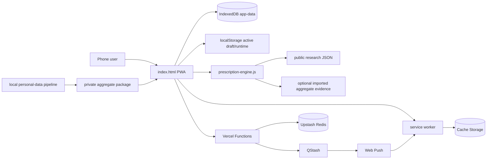
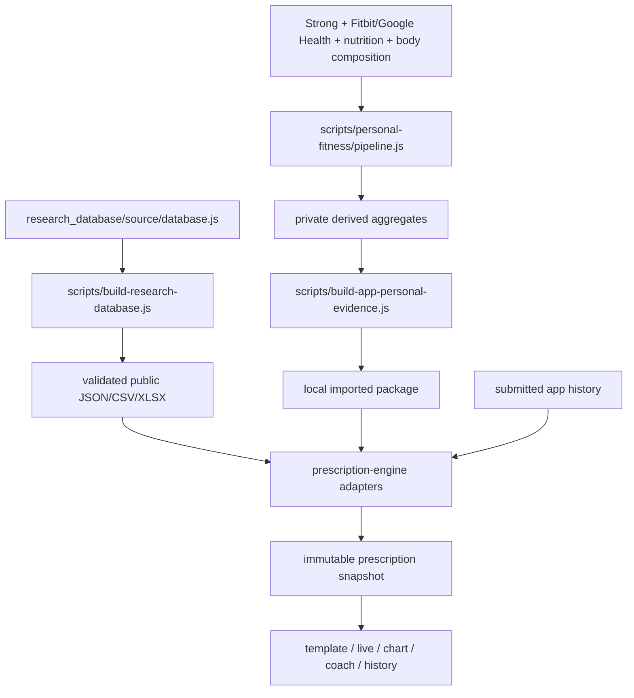

# Architecture

## Metadata

- **Purpose:** Verified technical architecture, data flows, and operational boundaries
- **Last verified:** 2026-07-11
- **Repository:** `main` @ `7c52a2b`
- **Verification status:** VERIFIED locally; external deployment/device status is not repository-verifiable
- **Related:** [Project](PROJECT.md), [decision engine](DECISION_ENGINE.md), [UI/UX](UI_UX.md), [roadmap](ROADMAP.md), [push backend](push-backend.md)

## Living-document rule

Read this document before changing application structure, dependencies, persistence, models, schemas, APIs, authentication, integrations, data flow, builds, deployment, or testing architecture. After implementation and verification, update the affected sections and `ROADMAP.md` in the same task. New source-of-truth files and migrations must be referenced here.

Repository instructions may express an approval preference, but they cannot alter the Codex sandbox or approval policy. Those controls belong to the execution environment; see `AGENTS.md`.

## Stack and repository layout

This is a dependency-light static PWA with Capacitor wrappers, not a bundled component-framework application.

| Area | Implementation |
| --- | --- |
| Web UI/state | Inline HTML/CSS/JavaScript in `index.html`; synchronized copy in `www/index.html` |
| Decision engine | UMD module `prescription-engine.js`; synchronized to `www/` |
| Rest lifecycle | UMD module `rest-completion-controller.js`; synchronized to `www/` |
| Persistence | IndexedDB primary, localStorage migration/fallback and compact active draft |
| Offline/install | `manifest.webmanifest`, `sw.js`, `resources/` |
| Serverless API | CommonJS Vercel Functions under `api/` |
| External services | Upstash Redis, QStash, standards-based Web Push/VAPID |
| Native shells | Capacitor 7 projects under `ios/` and `android/` |
| Research data | Source, schemas, exports, workbook, and validation under `research_database/` |
| Private analysis | Pipeline/config/schemas under `scripts/personal-fitness/` and `personal_fitness_data/` |
| Contracts | JSON Schema files under root `schemas/` |
| Verification | Dependency-free Node tests in `scripts/test-*.js`; PWA PowerShell verifier |

`npm run sync:web` is the canonical copy step from root web assets into `www/`. Root files are the editable source; duplicated `www/` files are packaging outputs.

## High-level system

## Frontend and state

`index.html` contains rendering, event delegation, domain calculations, migration code, persistence, imports, and push/sync clients. Five primary tab IDs map to Workout, Dashboard, Templates, Charts, and Settings. Views are generated as HTML strings and events are handled at the root through `data-action` delegation.

The normalized app object (`emptyData`, `normalizeLoadedData`) contains sessions, exercises, sets, templates, mesocycles, recommendation history, manual overrides, an optional personal evidence package, raw-import metadata, migration audit, revision, and settings. IDs are UUIDs when supported. The domain migration and set classifier preserve semantics across legacy data.

IndexedDB database `comprehensive-fitness`, store `state`, key `app-data` is primary. `comprehensive-fitness-data-v1` supports legacy/fallback state; runtime and a compact active draft use separate localStorage keys. Draft writes are debounced and the compact synchronous fallback protects immediate-close recovery. Completed-history calculations use revisioned caches (`scripts/test-performance.js`).

## Workout lifecycle

```mermaid
stateDiagram-v2
  [*] --> Idle
  Idle --> StartReview: choose template
  StartReview --> Active: explicit start
  Active --> Active: edit/complete/skip sets; timers
  Active --> CancelReview: request cancel
  CancelReview --> Idle: confirm cancel
  Active --> SubmitReview: request submit
  SubmitReview --> Active: cancel confirmation
  SubmitReview --> Submitted: confirm submit
  Submitted --> Summary: grade + lifts + PRs
  Summary --> History
  History --> EditDraft: explicit edit
  EditDraft --> Submitted: save edits and recalculate
```

Only `submitted`/completed sessions participate in canonical history and analytics (`activeCompletedWorkoutHistory`, `activeHistorySessions`). Starting a workout saves a workout prescription; exercises retain recommendation snapshots. Submission calculates PRs and workout analysis, timestamps completion, invalidates analysis caches, persists, and queues a sync mutation. Historical snapshots are not silently recomputed after engine changes.

## Models and relationships

- A **session** has many exercises and sets, recovery input, lifecycle timestamps/state, optional template/mesocycle context, PRs, and stored analysis.
- An **exercise** belongs to a session and references its sets; it holds muscle/resistance metadata, prescription/snapshot, notes, and deload/override state.
- A **set** belongs to an exercise and has sequence/type, targets, actual load/reps/RPE, completion/skip/edit flags, resistance semantics, and inclusion flags for score/volume/progression.
- A **template** owns exercise targets and set-role definitions but does not become history until a started workout is submitted.
- A **mesocycle** holds type, dates/lifecycle, constraints, per-muscle candidate pools, program slots, a selected full-program portfolio, distributed sessions, muscle plans, and an interaction review. `activeExercises` remains a compatibility projection of the selected portfolio for older persisted plans.
- A **recommendation snapshot** records engine/schema/evidence versions, base/final prescription, readiness adjustment, evidence, checksum, and append-only overrides (`schemas/recommendation-snapshot.v1.schema.json`).

The root JSON Schemas are application decision contracts. `personal_fitness_data/schemas/` describe private pipeline artifacts; `research_database/schema/` describes public research tables. These are distinct layers.

## Decision and evidence data flow

Mesocycle construction is portfolio-first: normalized evidence creates traceable candidate pools; research subdivisions are consolidated into user-facing muscle-family pools; program slots derive weekly volume/frequency requirements and select a coherent portfolio; the distributor allocates weekly sets across named split sessions; the review aggregates fatigue, spinal/grip demand, duration, overlap, direct/indirect volume, frequency, and recovery conflicts. Templates generated from a mesocycle consume these planned sessions rather than independently choosing exercises. Candidate selection reruns portfolio fit, set allocation, placement, and validation. `mesocycle/2.1.0` adds weekly set ranges, per-session planned sets/exposure indexes, and blocking-issue count.

`mesocycle/2.2.0` adds explicit scope persistence: `availableMuscleGroupIds`, `includedMuscleGroupIds`, structured `omittedMuscleGroups`, and `scopeConfirmed`. Scope filtering occurs before slot and portfolio generation. Generated templates use each session exercise's allocated `plannedSets`, not a newly recomputed generic exercise target.

Internal IDs remain persistence/engine values. The frontend `presentationLabel` adapter is the centralized display boundary for muscle IDs, roles, confidence states, structures, lifecycle enums, session IDs, and validation severity. New planner UI must pass internal values through that adapter rather than mutating persisted values.

The personal pipeline normalizes source data and produces workout-recovery links, exercise-session metrics, muscle volume/response, sweet spots, recovery rules, scores, and prescriptions. Direct live Fitbit and nutrition APIs are not implemented. Nutrition strategies are loaded into the engine, but in-app nutrition capture is limited to adequacy/protein status.

## Readiness, progress, units, and analytics

Readiness uses a user-configured baseline plus session inputs. The app and engine both implement conservative multi-domain logic; detailed rules are catalogued in `docs/DECISION_ENGINE.md`.

Analytics include submitted-history charts, estimated-performance comparisons appropriate to resistance type, PRs, weekly volume, fatigue flags, hypertrophy scores, and workout grades. Direct muscle sets count 1 and mapped secondary work fractionally; warm-ups and excluded/deload work are filtered according to domain semantics.

The header/settings controls use one `convertAppWeightUnit` boundary. It converts load-bearing app fields, updates explicit per-record `weightUnit`, preserves raw imports/private evidence in source units, and refreshes checksums on converted recommendation snapshots. Prescription adaptation converts a declared `prescribedLoad.unit` into the active app unit. Round-trip and source-boundary behavior is tested in `scripts/test-resistance-model.js`; snapshot integrity is tested in `scripts/test-prescription-engine.js`.

## Authentication, backend, and external integration

There is no account authentication. `api/push/register.js` creates or refreshes an installation record and returns a secret; later requests use a bearer token whose hash is compared in constant time (`api/_lib/security.js`). Workout sync is installation-authorized and idempotent by mutation ID. It writes serialized payloads to Redis but exposes no read endpoint.

Rest completion can be entirely foreground/local. Optional background delivery schedules QStash, records ownership/status in Redis, delivers Web Push, and lets `sw.js` show or route a notification. Web platform constraints mean custom sound/haptic/lock-screen timing cannot be guaranteed.

Required server environment names are documented without values in `.env.example`. Secrets must remain in deployment configuration.

## Error handling and privacy boundaries

Persistence falls back from IndexedDB to localStorage. Personal evidence URL loading tolerates protected/unavailable private sources and continues research-led. APIs return structured JSON errors and fail authorization. Service-worker navigation falls back to cached `index.html`.

Private raw/normalized/derived/reports data must not enter public web assets. `.vercelignore` blocks private payload paths; `sync:web` only creates an ignored private native payload when locally available. Exported app backups and Redis workout payloads may contain personal workout data and should be treated as sensitive.

## Testing, build, and deployment

- `npm test`: domain, safety, grade, expectation, rest, prescription, contract, integration, performance, set, and private-artifact tests.
- `npm run research:build` / `research:validate`: regenerate and validate research outputs.
- `npm run personal:build` / `personal:validate`: local private analysis only.
- `npm run sync:web` then `npm run verify:pwa`: synchronize packaging payload and verify PWA parity/assets.
- Daily Codex browser QA follows `docs/DAILY_BROWSER_QA.md`: it traverses primary navigation and the critical workout lifecycle at desktop/mobile widths, checks console and visual state, and requires a regression test plus browser re-verification for each fix.
- Repository-owned Playwright UI QA runs through `npm run audit:ui`. It covers all five primary destinations at mobile/desktop Chromium viewports, axe WCAG A/AA rules, overflow/clipping, console errors, source-style ceilings, documentation presence, and approved screenshots. GitHub Actions runs it weekly and on manual dispatch; artifacts and the structured Markdown report are retained for review.
- `npm run cap:sync`: copy web assets and update native projects.
- `npm run dev`: dependency-light local server.

Deployment configuration is inferred as Vercel from `api/`, `.vercelignore`, and docs; no `vercel.json` or CI workflow is present. Native release requires external signing/toolchains.

## Decisions, risks, and debt

- **Decision:** Local-first static app minimizes infrastructure and account requirements.
- **Decision:** One prescription snapshot feeds every app surface; tests enforce this.
- **Decision:** Separate public research, private personal evidence, and operational Redis data.
- **Risk:** `index.html` is about 790 KB and combines UI, state, domain logic, imports, and client integration; change isolation is weak.
- **Risk:** Root/`www` duplication requires disciplined synchronization.
- **Decision:** The prescription engine is the only readiness-scoring path. If unavailable, the app conservatively holds the base plan; illness/pain still forces rest/modify guidance.
- **Risk:** Redis sync is write-only and may create an expectation of recoverability not supported by UI/API.
- **Risk:** Static regex/Node tests verify many contracts but there is no browser E2E, accessibility automation, or native-device CI.
- **NEEDS REVIEW:** External production, Upstash region/status, and physical iPhone acceptance claims in operational docs require human re-verification.
